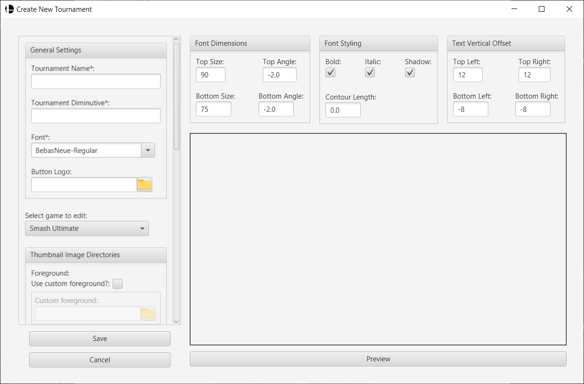
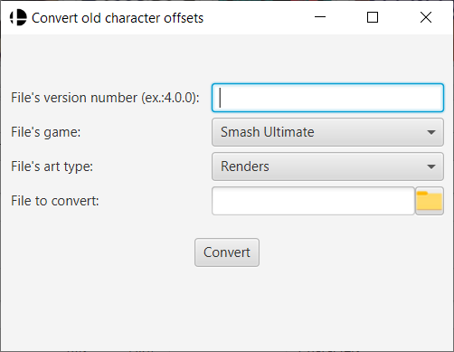
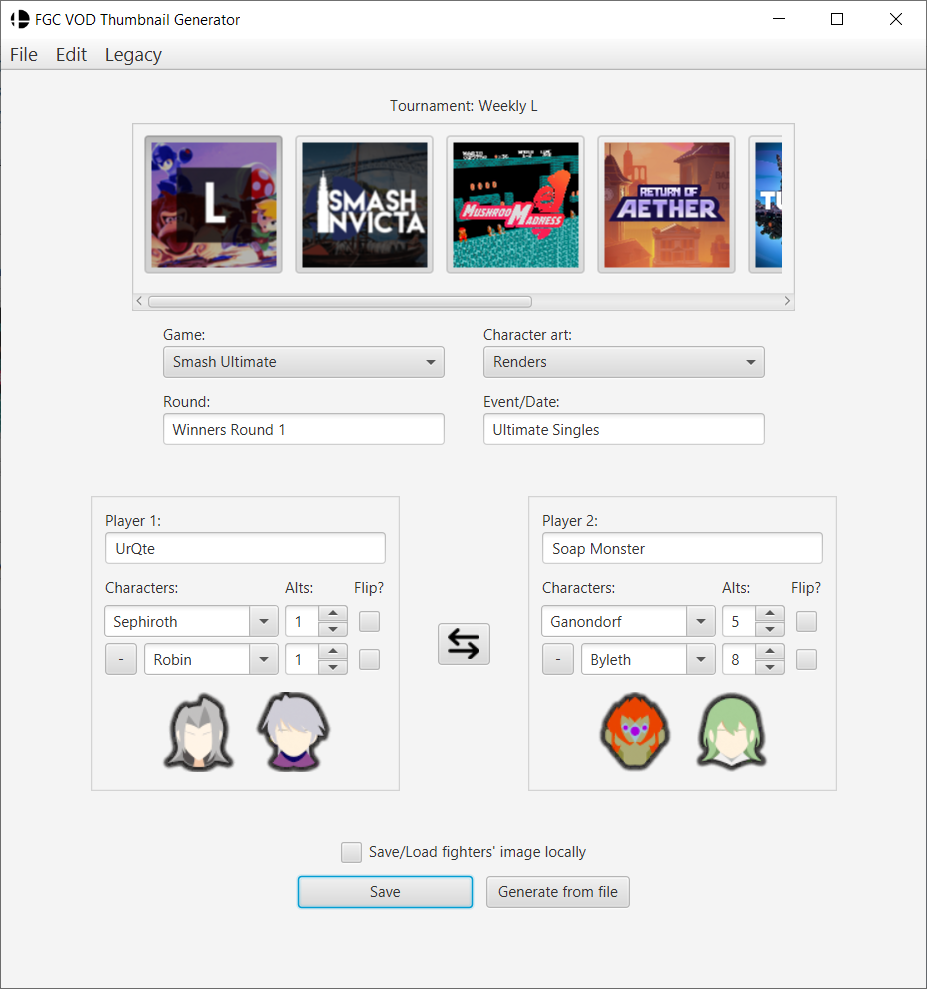
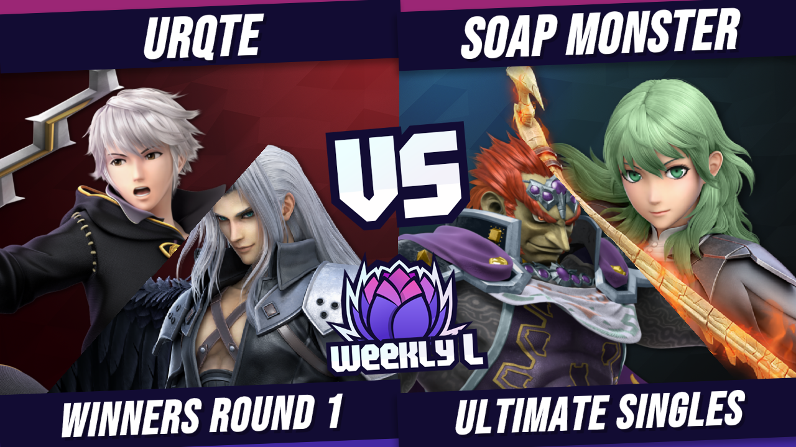
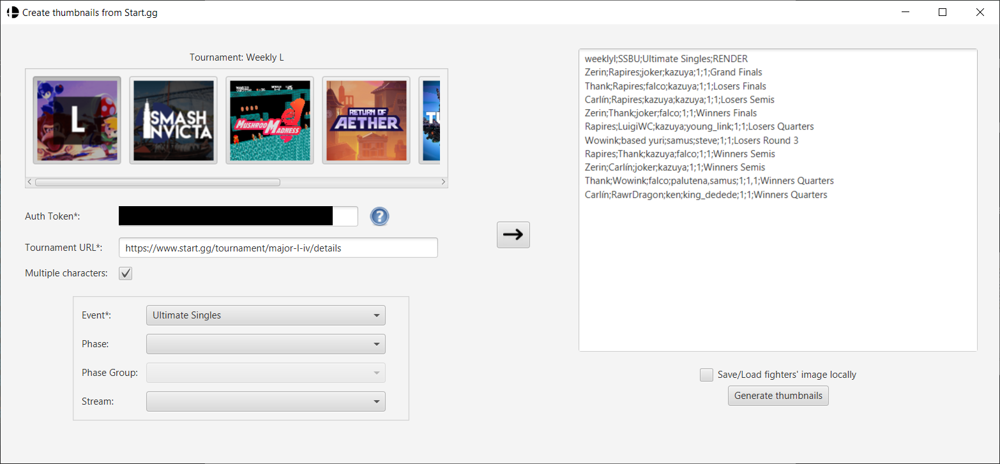
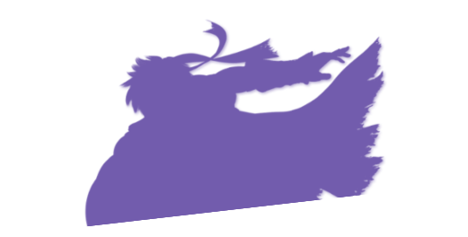

# Thumbnail Generator
	
## Introduction
This program was created to automate thumbnail creation for Smash Ultimate VODs. It is also compatible with some other fighting games. 
This allows TOs to speed up VODs' release process. Below are the compatible games:
- Smash Ultimate
- Smash Melee
- Smash 64 Remix
- Rivals of Aether 2
- Street Fighter 6
- Tekken 8
- Guilty Gear: Strive
- Fatal Fury: City of the Wolves
- Granblue Fantasy Versus: Rising

Thumbnails can be created:
 
 - one by one, on application's main page;
 - by batch generation, using a file;
 - by providing Start.gg tournament URL.
 
This program also allows users to program their own Top 8 generator.
It is not recommended to use this feature, as adjusting character's image's offsets for one single character can take around 20 minutes. 

This program can only be run in Windows.
Currently, it is the only environment where it can be tested.

## Initial Configuration
Click on ThumbnailGenerator.exe to start the program. 

Folder "assets" and folder "settings" need to be in the same directory
of the executable in order to work properly.

Program already has some tournaments available.
When setting up your tournament in the program, you can copy existing tournament's settings to have something already working.

If you created a tournament in a previous version, you can try to do one of the following. Do note that, depending on the version upgrade, it may not work:

 - replace save files in new version;
 - replace old executable with the new one.

## Tournament Settings
### Creating tournaments 
Tournament settings are save on the following file:

	settings/tournaments/tournaments.json

To add a new tournament, go to **Edit** -> **Create new tournament** when on program's main page.

A new window will appear where users can configure tournament settings for thumbnails and top 8 generation.
The following settings are obligatory to be provided in order to successfully create the tournament.
	
 - **Tournament Name** - name displayed by program when selecting tournament;
 - **Tournament Diminutive** - codename used by program to distinguish between other tournaments;
 - **Font** - used for text generation in thumbnails.

Thumbnails can have text being added during generation. Text is placed in four different positions:
 - **Top Left** - Player 1 name
 - **Top Right** - Player 2 name
 - **Bottom Left** - Round
 - **Bottom Right** - Date or Bracket Type
 
Regarding thumbnail generation, the following settings can be provided for each fighting game:
 - **Foreground** - Directory of foreground image to place on thumbnail. Use this to put headers, logos, "VS.", etc.;
 - **Background** - Directory of background image to place on thumbnail;
 - **Fighter Image Settings File** - Json file with offsets of character's images. Can provide one file for "Renders" art and another for "Mural" art.

None of this fields are mandatory. If no fighter image setting file is used, the program will use default files. Below are the default files used for Smash Ultimate:
 - **Renders** - settings/thumbnails/images/default.json
 - **Mural** - settings/thumbnails/images/defaultMural.json

When adding new foregrounds, backgrounds and logos, make sure they have the following dimensions:	
 - **foregrounds**: 1280x720;
 - **backgrounds**: 1280x720;
 - **logos**: 200x200.
 
Regarding top 8 generation, the following settings can be provided for each fighting game:
 - **Foreground** - Directory of foreground image to place on thumbnail;
 - **Background** - Directory of background image to place on thumbnail;
 - **Slot Settings File** - Json file where you what region on top 8 file, character iamges will be placed and how they are placed.
 - **Fighter Image Settings File** - Json file with offsets of character's images inside each slot. Can provide one file for "Renders" art and another for "Mural" art (SSBU only).

There is also a **Preview** option that allow users to preview thumbnail generation with current settings.
To save changes, just click on **Save** button.
 
### Copying tournaments
As an alternative of creating a tournament from scratch, it is possible to create a duplicated 
tournament by selecting **Edit** -> **Create copy of...** -> **<Tournament to copy>** and change this 
copy's settings.

### Deleting Tournaments 
Tournament settings can be deleted in **Edit** -> **Delete tournament** -> <Tournament to delete>.
A dialog box will appear to confirm whether this deletion is intentional.

## Character images
### Image download
All character images are downloaded from a [Github repository](https://www.smashbros.com/en_US/fighter/index.html), that I created.
Images were gathered thanks to:
- [Smash Ultimate official website](https://www.smashbros.com/en_US/fighter/index.html)
- [Melee HD Asset Library](https://assets.melee.tv/post/651913361021353984/definitive-melee-hd-texture-pack-for-dolphin-and)
- [@smashenmasse's Google Drive](https://drive.google.com/drive/folders/1AjaPFEJhD-adgG_RqKKrJ5LhGUCG25Pg) of Smash 64 Remix artworks
- [Rivals of Aether 2 Press Kit](https://rivals2.com/presskit)
- [Street Fighter 6 official website](https://www.streetfighter.com/6)
- [Tekken Warehouse](https://tekkenwarehouse.com/)
- [Fighters Collection's Guilty Gear: Strive Gallery](https://www.fightersgeneration.com/games/ggstrive-p2.html)
- [Fatal Fury: City of the Wolves official website](https://www.snk-corp.co.jp/us/games/fatalfury-cotw/)
- [GBFVR fan press kit](https://rising.granbluefantasy.jp/en/extras/fankit/)
- [smash-ultimate-assets](https://github.com/marcrd/smash-ultimate-assets) repository
- [MuralAltDrive's](https://x.com/MuralAltDrive) Smash Ultimate Mural art [Google Drive](https://drive.google.com/drive/folders/1n4lAP6YB7N-bSSgEDx0OPEI2ykOKSQrM)

As an option, Thumbnail Generator can save those downloaded images to use them for future uses without requiring access to the website. 
Images are stored in the following folder:

    assets/characters/[GAME]/[ART_TYPE]/

### Thumbnail Image Settings 
For thumbnails, images need to be scaled and repositioned in other to be printed 
correctly on the thumbnail. 

As mentioned in [Creating tournaments](#creating-tournaments) section, the program provides default settings files, for each game and art type pair.

If users are not satisfied with current settings, they can create a copy of the
these Json files and change parameters for the specific character.
Afterwards, users must edit tournament settings so that the tournament is mapped
to the new fighter image settings file.

These settings files have the following structure:

    {
        "mirrorPlayer2": true,
    	"fighters":[
    	  {
    		"fighter": "mario",
    		"offset": [
    		  60,
    		  0
    		],
    		"scale": 0.7,
    		"flip": false
    	  },
    	  {
    		"fighter": "donkey_kong",
    		"offset": [
    		  30,
    		  30
    		],
    		"scale": 0.65,
    		"flip": true
    	  },...

 - **mirrorPlayer2** - if true, character will be mirrored in player 2 position;
 - **fighter** - character name as represented in Smash Ultimate website urls;
 - **offset** - horizontal (- left, + right) and vertical (- up, + down) offsets by pixels;
 - **scale** - scale multiplier for image resizing;
 - **flip** - tells whether image should be flipped. If true, image is flipped (default = false).

To note that if image is flipped, horizontal offset orientation is also flipped.
All these values can be changed to fit users preferences and can be changed and tested at run time.

As of version **4.3.0**, thumbnail character positioning has been changed and simplified by using masks.
This has impact on offsets, as new offsets need to be used to get desired character positioning.
All thumbnail image settings files provided have **already been converted**.
However if you have a custom file, you can convert it by going to **Legacy** -> **Convert old character offsets**

Conversion requires internet access as it needs character's images to properly calculate new offset.
Therefore, users must also select correct Game and Art Type related to image settings file to get correct images.

### Top 8 image settings
For top 8 generation, images need to be scaled and repositioned in other to be printed 
correctly on the graphic. 
Besides that, the program needs to know how the image will be cropped in the top 8 graphic.

Therefore 2 sets of Json files are used:
 
 - Slots settings file - used to indicate area in top 8 that is dedicated to character image
 - Fighter image settings file - sets offsets and scaling for character's image inside each slot.
 
#### Slot settings
Here is part of a slot settings file:

    {	
    	"width": 1920,
    	"height": 1080,
    	"slots":[
    		{
    			"place": 1,
    			"mask": "assets/masks/locus/quadri1.png",
    			"scale": 1.0,
    			"coordinate_x": 40,
    			"coordinate_y": 40,
    			"shadow":{"rgbColor": "725cad", "coordinate_x": -20,"coordinate_y": 0},
    			"additionalFightersPosition_x":"10+64i",		
    			"additionalFightersPosition_y":"150"
    		},{
    			"place": 2,
    			"mask": "assets/masks/locus/quadri2.png",
    			"scale": 1.0,
    			"coordinate_x": 502,
    			"coordinate_y": 40,
    			"shadow":{"rgbColor": "725cad", "coordinate_x": 20,"coordinate_y": 0},
    			"additionalFightersPosition_x":"30+64i",		
    			"additionalFightersPosition_y":"300"
    		},{
    			"place": 3,
    			"mask": "assets/masks/locus/quadri3.png",
    			...

 - **width** - width of your expected top 8 graphic
 - **height** - height of your expected top 8 graphic
 - **slots** - list of slot settings. Size is equal to number of players you want to place in your graphic. For top 8, you want 8
    - **place** - id of slot. It is suggested that it to be equal to tournament placement to list in top 8 graphic. Used to map to correct fighter image setting 
    - **mask** - path to file created by you that is equal to region on top 8 graph where a character is placed.
    - **scale** - scales mask file provided in **mask**
    - **coordinate_x** - x coordinate where top left corner of mask image is placed
    - **coordinate_y** - y coordinate where top left corner of mask image is placed
    - **shadow** - you can define a shadow effect on character image. Provide colour in RGB hexadecimal and its offset to character image
    - **additionalFightersPosition_x** - x coordinate equation for additional characters, using stock icons. **i** is the variable and it can only be a natural number, starting at 0 
    - **additionalFightersPosition_y** - y coordinate equation for additional characters, using stock icons. **i** is the variable and it can only be a natural number, starting at 0 

Example files can be found in the following directories:

 - **Slot settings** - settings/top8/slot/
 - **Masks** - assets/masks/
   
#### Fighter image settings file
For top 8, these files have similar structure as the same settings file for thumbnail generation.
However, now it is required to provide character image scaling, offset and flip setting **for each slot** you plan to put on top 8 graphic, **for each character**.

Below is part of a settings file, for a graphic with 8 slots:

    [{
    	"fighters":[
    	  {
    		"fighter": "mario",
    		"slots":[
    		  {"slot": 1, "offset": [-30,100], "scale": 0.6, "flip":false},
    		  {"slot": 2, "offset": [60,0], "scale": 0.4, "flip":false},
    		  {"slot": 3, "offset": [120,0], "scale": 0.3, "flip":false},
    		  {"slot": 4, "offset": [120,-50], "scale": 0.3, "flip":false},
    		  {"slot": 5, "offset": [60,-20], "scale": 0.3, "flip":false},
    		  {"slot": 6, "offset": [0,-20], "scale": 0.3, "flip":false},
    		  {"slot": 7, "offset": [120,0], "scale": 0.25, "flip":false},
    		  {"slot": 8, "offset": [120,-50], "scale": 0.25, "flip":false}
    		]
    	  },{
    		"fighter": "donkey_kong",
    		"slots":[
    		  {"slot": 1, "offset": [-175,150], "scale": 0.6, "flip":false},
    		  {"slot": 2, "offset": [-10,10], "scale": 0.4, "flip":false},
    		  {"slot": 3, "offset": [60,40], "scale": 0.3, "flip":false},
    		  {"slot": 4, "offset": [60,-20], "scale": 0.3, "flip":false},
    		  {"slot": 5, "offset": [-25,10], "scale": 0.3, "flip":false},
    		  {"slot": 6, "offset": [-65,10], "scale": 0.3, "flip":false},
    		  {"slot": 7, "offset": [80,0], "scale": 0.25, "flip":false},
    		  {"slot": 8, "offset": [60,-30], "scale": 0.25, "flip":false}
    		]
    	  },{
    		"fighter": "link",
    		"slots":[
    		  {"slot": 1, "offset": [0,0], "scale": 0.6, "flip":false},
    		  {"slot": 2, "offset": [0,0], "scale": 0.4, "flip":false},

 - **fighter** - url name used for characters
 - **slots** - list of image settings for each slot 
    - **slot** - id of target slot, defined in slot settings file
    - **offset** - character image offset when placed in slot/mask
    - **scale** - character image scaling when placed in slot/mask
    - **flip** - when true, flips character image when placed in slot/mask
     

Example files can be found in the following directories:

 - **Fighter image settings settings** - settings/top8/images/

## Thumbnail generation
As mentioned in [Introduction](#introduction) section, thumbnails can be generated in 3 ways:
 
 - one by one, on application's main page;
 - by batch generation, using a file;
 - by providing Start.gg tournament URL.
 
### Single thumbnail generation
This is the main page of the application. it is currently filled with data for thumbnail generation.

Tournaments that were created and stored in **settings/tournaments/tournaments.json** are shown at the top. 
Users must click on tournament to select the desired thumbnail configurations.

As of version **4.0.0**, users can generate thumbnails and top8 for other games other than Smash Ultimate.
When selecting a game from the dropdown, character list is updated with characters of respective selected game.
The available games are the following:
- Smash Ultimate
- Smash Melee
- Smash 64 Remix
- Rivals of Aether 2
- Street Fighter 6
- Tekken 8
- Guilty Gear: Strive
- Fatal Fury: City of the Wolves
- Granblue Fantasy Versus: Rising

It is also mandatory to provide characters and their colours.
When selecting a character from the dropdown, an icon will appear
This icon is the respective stock icon of the selected character.
Its colour also changes when selecting a different alt.

Users can add a second character per player by clicking on "+" button.
Doing so, makes button change to "-" and makes second character mandatory for thumbnail generation.
Clicking on "-" removes second character and makes it non mandatory for thumbnail generation.

To have a better look at the selected alt, the icon can be clicked
to show a fighter image that will appear on the thumbnail (character and alt).

If the user has the respective fighter and alt saved on folder
**"assets/characters/**, the program will open this images locally.
Otherwise, it will open image's location online

Text fields like players' names, round and date/event are not mandatory for thumbnail generation.
Text provide here will be printed around top and bottom corners of thumbnail image.

Users can also select different renders for characters in **Character art** dropdown when selecting Smash Ultimate. Remaining games only have 1 art type for now.
 
To save character image's locally during generation, tick **Save/Load fighters' image locally** checkbox.

To begin generation click on **Save** button.
After some time, a popup will appear, telling that thumbnail was created.
Thumbnails are saved in **/generated_thumbnails** folder, which is created in the same folder as the program, during first thumbnail creation.

When generating thumbnails with more than one character per player, characters will be displayed as show below.
Main character of each player will be at the bottom of the image, while secondary characters will be at the top.

this thumbnail uses mask images to split player's characters. These masks are in the following folder:

    assets\masks\thumbnails\

Said mask images can be change, removed or renamed by users to provide different looks to thumbnail.
Below is same thumbnail generated without said masks:

### Multiple thumbnail generation by file
Multiple thumbnails can ge generated at once using a file with a list of commands.

To use said file and start multi generation, users can click on **Generate from file** button or on **File** -> **Generate thumbnails from file**

Character images used during batch generation can be saved locally if **Save/Load fighter's image locally** checkbox is checked, at program's main page, before starting multi generation.

Below is an example of a file to be used:

    invicta;20/02/20XX;SSBU;render
    UrQte;Arjay;robin,sephiroth;byleth;1,1;8;Losers
    fizbo;Darkout;pikachu;pokemon_trainer;4;5;winners Semis
    Chime;Toaster;rob;marth;2;5;Grand Finals
    
The first line has common data between thumbnails, separated by **;**:

 1. **Tournament Diminutive** - tournament id, provided by user, during tournament settings creation;
 2. **Date/Event** - text that will be placed around bottom right corner of thumbnail. Usually date or event of the set. It is not case sensitive;
 3. **Game** - code name of the fighting game for which you want to create a tournament VOD thumbnail. It is not case sensitive (ssbu, roa2, sf6, tekken8)
 4. **Character art** - character art to be placed in thumbnails. It is not case sensitive (render, mural).

Each following lines represents a thumbnail and has unique data for that thumbnail, also separated by **;**:

 1. **Player 1 name** - thumbnail's left side player's name. It is not case sensitive;
 2. **Player 2 name** - thumbnail's right side player's name. It is not case sensitive; 
 3. **Player 1 character** - thumbnail's left side player's character url name;
 4. **Player 2 character** - thumbnail's right side player's character url name;
 5. **Player 1 character alt** - thumbnail's left side player's character alt number;
 6. **Player 2 character alt** - thumbnail's right side player's character alt number;
 7. **Round** - text that will be placed around bottom left corner of thumbnail. Usually round name. It is not case sensitive.

Flip data is not provided, as it is automated by settings created in respective fighter image settings file
To add more than one character per player, put first character code name, put a comma after first character name, then add second character name;
Repeat the same steps for alt number to provide alt data of second character. 
If no alt data is provided for second character, program will use alt number 1 of second character.

Thumbnails are saved in **/generated_thumbnails** folder

### Multiple thumbnail generation by Start.gg
Multi thumbnail generation of a Start.gg tournament is available on **File** -> **Generate thumbnails from Start.gg**

During this generation, the following steps are performed by this Thumbnail Generator:

 1. Get list of events, phases and phase groups of tournament provided by user;
 2. Query Start.gg for sets on event, phase or phase group selected by user;
 3. Check which sets have a stream associated to them and write them on text area according to 4.1. rules;
 4. Generate thumbnails, according to text area commands, when clicking on "Generate thumbnails" button; 

It is important that users provide an Authorization Token before making any requests to Start.gg
To create your own Authorization Token, please look at the following [documentation](https://developer.start.gg/docs/authentication/).

When a Auth Token is given, users can provide tournament URL and, by clicking away from the corresponding text box, users can query Start.gg to get available events, phases and phases groups.

After selecting an event, phase or phase group on the combo boxes, text commands can be generated by clicking on the arrow button that is in the middle of the window.

Depending on the number of participants of the tournament and the selections of the user, this step can take some time.

To save character image's locally during generation, tick **Save/Load fighters' image locally** checkbox.
Thumbnails are saved in **/generated_thumbnails** folder.

If users close Start GG thumbnail generation window, the program will store provided api key in the following file:

    settings/startgg/auth-token.txt
    
Auth token is then loaded from said file when users open Start GG thumbnail generation window again.

Additional Notes:
 - Users can edit the commands directly on the text area;
 - Start.gg does not provide info on used alts and some tournaments may not even provide used characters (ex.: offline tournaments);
 - Alts are set to the default alt and characters, when missing, are set to random;
 - If no commands are printed, it means that the program could not find a set with a stream assigned;
 - Start.GG generations does **not** work for **Granblue Rising**, as Start.GG does not have character data for said game...
 - For Smash 64 Remix, Start.GG generations only recognizes Smash 64's 12 original characters only;
 - Could not validate how to generate thumbnails for Doubles matches, as I could not find any Doubles Bracket with characters reported.

## Top 8 generation 
### Start Top 8 generation
The program can allow users to **program** their top 8 generator.
It is not recommended to use said feature alone, as Smash Ultimate has more that 80 characters and each character will require 8 different settings for scaling, offset and flip.

Top 8 can only be generated by a file 
Assuming that settings are correctly configured, top 8 generation is started by selecting **File** -> **Generate Top 8 from file**.
Below is an file example for top 8 generation:

    weeklyl;SSBU;render
    pokemon_trainer;6
    kazuya;6
    roy;3;donkey_kong;1
    yoshi;2
    little_mac;4;kazuya;1;sephiroth;7
    jigglypuff;4;wario;1
    ganondorf;7
    joker;7;luigi;1;king_dedede
 
First line contains the target tournament's diminutive and target fighting game code. 
You can also include the art type, but it is optional. 
Each following line represents characters of each player, and alternate between character url name and its alt.

The first character will be shown with its "expected" art. 
Remaining characters will be shown as stock icons.
Stock icons are placed according to equations provided in slot settings file.

It is recommended to generate top 8 without background and foreground.
Resulting image will only have characters present and cropped.
This image can then be placed on Photoshop project between your background and foreground elements, including text.

### Top 8 generation process
Program will first create an empty image with dimensions specified in selected tournament's slots settings file.
If a background image is provided, it will be printed on empty image.
The same goes for foreground image, but is placed at the end of process, just before saving image.

In between these processes, each slot is printed in image, with its characters.
Each slot has a mask associated with it and it is loaded first.

The idea of the mask is to crop the original image. Think as if we are putting character image in said slot.
To note that any colour background on the mask will be ignored so taht it does not collide with any background and foreground elements.

The shadow is put first on mask, as it goes behind character art.
Shadow combines offsets from fighter image settings and shadow offsets from slot settings file.

Afterwards, character image is put inside mask, using provided fighter image settings for respective slot.

Slot generation is finally finished by placing any additional character mentioned in file, using their respective stock image.
Position of stock images behave according to equations provided in  slot settings file.
**i=0** represents player's 2nd character, **i=1** represents player's 3rd character, and so on.

 
 

Thumbnails are saved in **/generated_top8** folder.

## Miscellaneous
### Missing Mural art
 - Bowser Jr. - 3, 4, 5
 - Ganondorf - 2, 4, 6
 - Ike - 2, 4, 6, 8
 - Incineroar - 5, 8
 - Inkling - 4, 5, 6, 7, 8
 - Jigglypuff - 3, 6, 7, 8
 - Little Mac - 6, 8
 - Mario - 8
 - Marth - 3, 7
 - Pichu - 2
 - Pikachu - 4, 5, 6
 - Sephiroth - 7, 8
 - Shulk - 6, 7, 8
 - Sonic - 7
 - Sora - 2, 4, 6, 8
 - Villager - 2, 3, 4, 6
 - Random - 2 (Sandbag)

### Smash Ultimate Character URL names

| Character          | URL Name           |
|--------------------|--------------------|
| Mario              | mario              |
| Donkey Kong        | donkey_kong        |
| Link               | link               |
| Samus              | samus              |
| Yoshi              | yoshi              |
| Kirby              | kirby              |
| Fox                | fox                |
| Pikachu            | pikachu            |
| Luigi              | luigi              |
| Ness               | ness               |
| Captain Falcon     | captain_falcon     |
| Jigglypuff         | jigglypuff         |
| Peach              | peach              |
| Bowser             | bowser             |
| Ice Climbers       | ice_climbers       |
| Sheik              | sheik              |
| Zelda              | zelda              |
| Dr. Mario          | dr_mario           |
| Pichu              | pichu              |
| Falco              | falco              |
| Marth              | marth              |
| Young Link         | young_link         |
| Ganondorf          | ganondorf          |
| Mewtwo             | mewtwo             |
| Roy                | roy                |
| Mr. Game & Watch   | mr_game_and_watch  |
| Meta Knight        | meta_knight        |
| Pit                | pit                |
| Zero Suit Samus    | zero_suit_samus    |
| Wario              | wario              |
| Snake              | snake              |
| Ike                | ike                |
| Pokémon Trainer    | pokemon_trainer    |
| Diddy Kong         | diddy_kong         |
| Lucas              | lucas              |
| Sonic              | sonic              |
| King Dedede        | king_dedede        |
| Olimar             | olimar             |
| Lucario            | lucario            |
| R.O.B.             | rob                |
| Toon Link          | toon_link          |
| Wolf               | wolf               |
| Villager           | villager           |
| Mega Man           | mega_man           |
| Wii Fit Trainer    | wii_fit_trainer    |
| Rosalina & Luma    | rosalina_and_luma  |
| Little Mac         | little_mac         |
| Greninja           | greninja           |
| Mii Brawler        | mii_brawler        |
| Mii Swordfighter   | mii_swordfighter   |
| Mii Gunner         | mii_gunner         |
| Palutena           | palutena           |
| Pac-Man            | pac_man            |
| Robin              | robin              |
| Shulk              | shulk              |
| Bowser Jr.         | bowser_jr          |
| Duck Hunt Duo      | duck_hunt          |
| Ryu                | ryu                |
| Cloud              | cloud              |
| Corrin             | corrin             |
| Bayonetta          | bayonetta          |
| Inkling            | inkling            |
| Ridley             | ridley             |
| Simon              | simon              |
| King K. Rool       | king_k_rool        |
| Isabelle           | isabelle           |
| Incineroar         | incineroar         |
| Piranha Plant      | piranha_plant      |
| Joker              | joker              |
| Hero               | dq_hero            |
| Banjo & Kazooie    | banjo_and_kazooie  |
| Terry              | terry              |
| Byleth             | byleth             |
| Min Min            | minmin             |
| Steve              | steve              |
| Sephiroth          | sephiroth          |
| Pyra & Mythra      | pyra               |
| Kazuya             | kazuya             |
| Sora               | sora               |
| Dark Pit           | dark_pit           |
| Lucina             | lucina             |
| Daisy              | daisy              |
| Chrom              | chrom              |
| Dark Samus         | dark_samus         |
| Richter            | richter            |
| Ken                | ken                |
| Random             | random             |

### Smash Melee Character URL names

| Character          | URL Name           |
|--------------------|--------------------|
| Mario              | mario              |
| Donkey Kong        | donkey_kong        |
| Link               | link               |
| Samus              | samus              |
| Yoshi              | yoshi              |
| Kirby              | kirby              |
| Fox                | fox                |
| Pikachu            | pikachu            |
| Luigi              | luigi              |
| Ness               | ness               |
| Captain Falcon     | captain_falcon     |
| Jigglypuff         | jigglypuff         |
| Peach              | peach              |
| Bowser             | bowser             |
| Ice Climbers       | ice_climbers       |
| Sheik              | sheik              |
| Zelda              | zelda              |
| Dr. Mario          | dr_mario           |
| Pichu              | pichu              |
| Falco              | falco              |
| Marth              | marth              |
| Young Link         | young_link         |
| Ganondorf          | ganondorf          |
| Mewtwo             | mewtwo             |
| Roy                | roy                |
| Mr. Game & Watch   | mr_game_and_watch  |
| Random             | random             |

### Smash 64 Remix Character URL names

| Character          | URL Name           |
|--------------------|--------------------|
| Mario              | mario              |
| Donkey Kong        | donkey_kong        |
| Link               | link               |
| Samus              | samus              |
| Yoshi              | yoshi              |
| Kirby              | kirby              |
| Fox                | fox                |
| Pikachu            | pikachu            |
| Luigi              | luigi              |
| Ness               | ness               |
| Captain Falcon     | captain_falcon     |
| Jigglypuff         | jigglypuff         |
| Ganondorf          | ganondorf          |
| Young Link         | young_link         |
| Falco              | falco              |
| Dr. Mario          | dr_mario           |
| Dark Samus         | dark_samus         |
| Wario              | wario              |
| Lucas              | lucas              |
| Bowser             | bowser             |
| Wolf               | wolf               |
| Conker             | conker             |
| Mewtwo             | mewtwo             |
| Marth              | marth              |
| Sonic              | sonic              |
| Classic Sonic      | classic_sonic      |
| Sheik              | sheik              |
| Marina             | marina             |
| King Dedede        | king_dedede        |
| Goemon             | goemon             |
| Banjo & Kazooie    | banjo_and_kazooie  |

### Rivals of Aether 2 URL names

| Character          | URL Name           |
|--------------------|--------------------|
| Clairen            | clairen            |
| Fleet              | fleet              |
| Forsburn           | forsburn           |
| Kragg              | kragg              |
| Loxodont           | loxodont           |
| Maypul             | maypul             |
| Orcane             | orcane             |
| Ranno              | ranno              |
| Wrastor            | wrastor            |
| Zetterburn         | zetterburn         |
| Etalus             | etalus             |
| Olympia            | olympia            |

### Street Fighter 6 URL names

| Character          | URL Name           |
|--------------------|--------------------|
| Ryu                | ryu                |
| Luke               | luke               |
| Jamie              | jamie              |
| Chun-Li            | chunli             |
| Guile              | guile              |
| Kimberly           | kimberly           |
| Juri               | juri               |
| Ken                | ken                |
| Blanka             | blanka             |
| Dhalsim            | dhalsim            |
| E.Honda            | ehonda             |
| Dee Jay            | deejay             |
| Manon              | manon              |
| Marisa             | marisa             |
| JP                 | jp                 |
| Zangief            | zangief            |
| Lily               | lily               |
| Cammy              | cammy              |
| Rashid             | rashid             |
| A.K.I.             | aki                |
| Ed                 | ed                 |
| Akuma              | akuma              |
| M. Bison           | m_bison            |
| Terry              | terry              |
| Mai                | mai                |

### Tekken 8 URL names

| Character          | URL Name           |
|--------------------|--------------------|
| Alisa              | alisa              |
| Asuka              | asuka              |
| Azucena            | azucena            |
| Bryan              | bryan              |
| Claudio            | claudio            |
| Devil Jin          | devil_jin          |
| Feng               | feng_wei           |
| Hwoarang           | hwoarang           |
| Jack-8             | jack_8             |
| Jin                | jin                |
| Jun                | jun                |
| Kazuya             | kazuya             |
| King               | king               |
| Kuma               | kuma               |
| Lars               | lars               |
| Lee                | lee                |
| Leo                | leo                |
| Leroy              | leroy              |
| Lili               | lili               |
| Xiaoyu             | xiaoyu             |
| Law                | law                |
| Nina               | nina               |
| Panda              | panda              |
| Paul               | paul               |
| Raven              | raven              |
| Reina              | reina              |
| Dragunov           | dragunov           |
| Shaheen            | shaheen            |
| Steve              | steve              |
| Victor             | victor             |
| Yoshimitsu         | yoshimitsu         |
| Zafina             | zafina             |
| Eddy               | eddy               |
| Lidia              | lidia              |
| Heihachi           | heihachi           |
| Clive              | clive              |
| Anna               | anna               |

###Guilty Gear: Strive URL names

| Character           | URL Name           |
|---------------------|--------------------|
| Sol Badguy          | sol                |
| Ky Kiske            | ky                 |
| May                 | may                |
| Axl Low             | axl                |
| Chipp Zanuff        | chipp              |
| Potemkin            | potemkin           |
| Faust               | faust              |
| Millia Rage         | millia             |
| Zato=1              | zato               |
| Ramlethal Valentine | ramlethal          |
| Leo Whitefang       | leo                |
| Nagoriyuki          | nagoriyuki         |
| Giovanna            | giovanna           |
| Anji                | anji               |
| I-No                | ino                |
| Goldlewis Dickinson | goldlewis          |
| Jack-O'             | jack_o             |
| Happy Chaos         | happy_chaos        |
| Baiken              | baiken             |
| Testament           | testament          |
| Bridget             | faust              |
| Sin Kiske           | sin                |
| Bedman?             | bedman             |
| Asuka R #           | asuka              |
| Johnny              | johnny             |
| Elphet Valentine    | elphet             |
| A.B.A               | aba                |
| Slayer              | slayer             |
| Dizzy               | dizzy              |
| Venom               | venom              |
| Random              | random             |

###Fatal Fury: City of the Wolves URL names

| Character           | URL Name           |
|---------------------|--------------------|
| Rock Howard         | rock               |
| Terry Bogard        | terry              |
| B. Jenet            | jenet              |
| Marco Rodrigues     | marco              |
| Preecha             | preecha            |
| Hotaru Futaba       | hotaru             |
| Vox Reaper          | vox                |
| Tizoc               | tizoc              |
| Kevin Rian          | kevin              |
| Billy Kane          | billy              |
| Mai Shiranui        | mai                |
| Kim Dong Hwan       | kim                |
| Gato                | gato               |
| Kain R. Heinlein    | kain               |
| Cristiano Ronaldo   | cr7                |
| Salvatore Ganacci   | ganacci            |
| Hokuto Maru         | hokuto             |

###Granblue Fantasy Versus: Rising URL names

| Character          | URL Name           |
|--------------------|--------------------|
| Gran               | gran               |
| Djeeta             | djeeta             |
| Katalina           | katalina           |
| Charlotta          | charlotta          |
| Lancelot           | lancelot           |
| Percival           | percival           |
| Ladiva             | ladiva             |
| Metera             | metera             |
| Lowain             | lowain             |
| Ferry              | ferry              |
| Zeta               | zeta               |
| Vaseraga           | vaseraga           |
| Narmaya            | narmaya            |
| Soriz              | soriz              |
| Zooey              | zooey              |
| Cagliostro         | cagliostro         |
| Yuel               | yuel               |
| Anre               | anre               |
| Eustace            | eustace            |
| Seox               | seox               |
| Vira               | vira               |
| Beelzebub          | beelzebub          |
| Belial             | belial             |
| Avatar Belial      | avatar_belial      |
| Lunalu             | lunalu             |
| Anila              | anila              |
| Siegfried          | siegfried          |
| Grimnir            | grimnir            |
| Nier               | nier               |
| Lucilius           | lucilius           |
| 2B                 | 2b                 |
| Vane               | vane               |
| Beatrix            | beatrix            |
| Versusia           | versusia           |
| Vikala             | vikala             |
| Sandalphon         | sandalphon         |

### Release Notes
#### v4.2.0
- Added Smash Melee, Guilty Gear: Strive and Granblue Fantasy Versus: Rising as selectable games;
- Thumbnail and Top8 generation are now run in multiple threads, allowing parallel generation
- Added loading indicator for Thumbnail and Top8 generations.

#### v4.1.0
- Added Fatal Fury: City of the Wolves as a selectable game;
- Latest Start GG API auth-token provided by user is now automatically loaded when requesting Start GG thumbnail generation; 
- Image fetchers now check 2 branch versions of ThumbnailGeneratorCharacterImageRepository before throwing an error;
- Set a custom JRE to allow generator to run in any PC with no Java installed.

#### v4.0.0
- Thumbnails and Top8 graphs can be generated for other games (Rivals of Aether 2, Street Fighter 6 and Tekken 8);
- Character images are now downloaded from ThumbnailGeneratorCharacterImageRepository repository, instead of depending on other websites;
- Fixed Chrom's mural art settings (Issue [#55](https://github.com/jonborg/ThumbnailGenerator/issues/55) opened and fixed by JoVoStudios)

#### v3.0.0
- Added option for users to program their Top 8 Generator;
- Added "Random" to character selection (Question mark, Sandbag);
- Added mural art for Pikachu's alt 2 and 7.

#### v2.2.0
- @ElevenZM's and @MuralAltDrive's mural arts can now be selected for thumbnail generation;
- Fixed compatibility issues with Start.gg (Smash.gg's new name);
- Fixed R.O.B icon colour assignment for alts 1 and 2;
- Increased gson version to 2.8.9.

#### v2.1.1
- Fixed issue when no image settings is found for a character, no message is shown to the user telling that;
- Fixed image settings names for Mii Gunner and Corrin;
- Increased log4j version to 2.17.1.

#### v2.1.0
- Added Stream filter for Smash.gg thumbnail generation;
- Can assign different fighter image settings for each tournament;
- Added log support to track application usage for debug analysis;
- Fixed issue were Rosalina, Young Link and Incineroar would not show their preview icons;
- Fixed issue with fonts when no font styling (bold and italic) was selected, which would not allow thumbnail generation;
- Kazuya added to the roster;
- Sora added to the roster.

#### v2.0.0
- Thumbnails can now be generated for Smash.gg tournaments;
- Tournament settings can be created, edited or deleted;
- Menu bar added to initial page to select Thumbnail Generator's functionalities.

#### v1.4.0
- Scroll pane added to tournament list;
- Updated Falco horizontal offset from -10 to 60;
- Sephiroth added to the roster;
- Pyra/Mythra added to the roster.

#### v1.3.0
- Steve added to the roster;
- Character icons appear when selecting a character and alt;
- A preview image of the chosen fighter and alt appears when clicking on character icon;
- Tournaments are now loaded from file "settings/tournaments/tournaments.json" to personalize available tournaments;
- Thumbnail settings such as font type and size can de adjusted on file "settings/thumbnail/text/text.json";
- Added "Pikmin Normal.tf" to allow creation of Alph Apparition thumbnails.

#### v1.2.2
- Min Min added to the roster;
- Added Tiamat as a league.

#### v1.2.1
- Thumbnail font is now locally loaded. Now is not required to have the font installed on PC.

#### v1.2.0
- Enabled text search when selecting fighters on their dropdowns;
- Errors during Thumbnail creation via file does not interrupt the parsing of the file anymore;
- Each cause of errors during Thumbnail creation via file is individually shown to the user;
- Some code improvements/cleanup was performed (let's see if it didn't break anything).

#### v1.1.0
- Multi thumbnail generation from 1 file in csv syntax;
- Switch button that swaps player 1 and player 2 information;
- Added Smash or Pass online league thumbnail generation.
